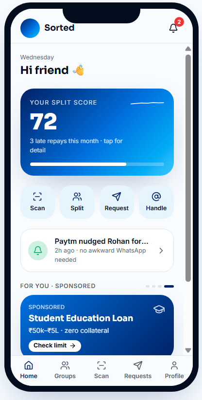
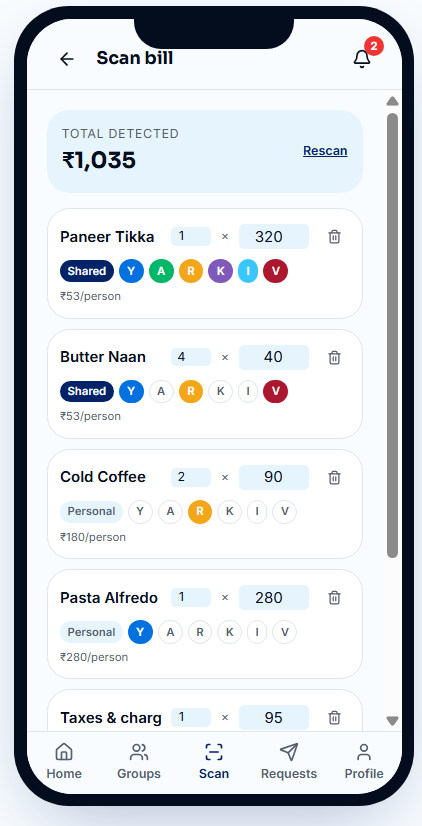
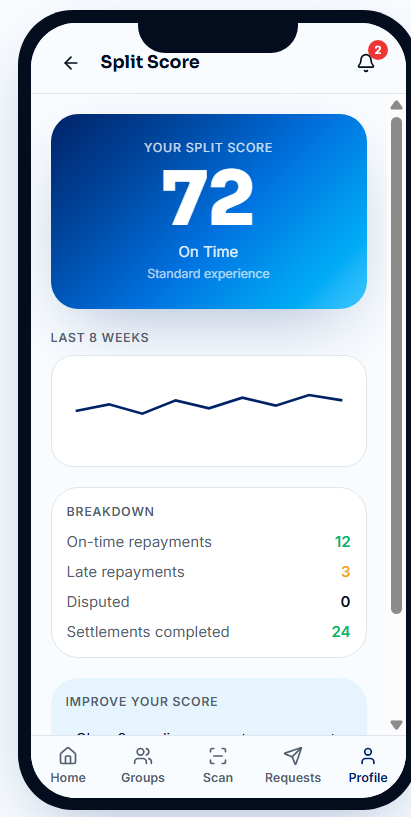
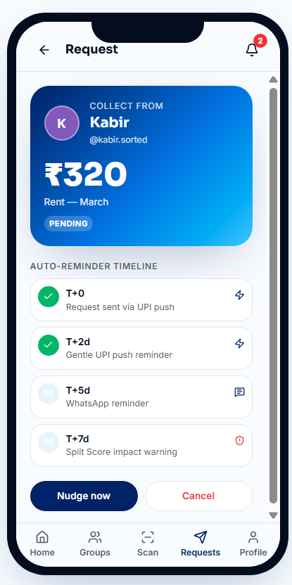
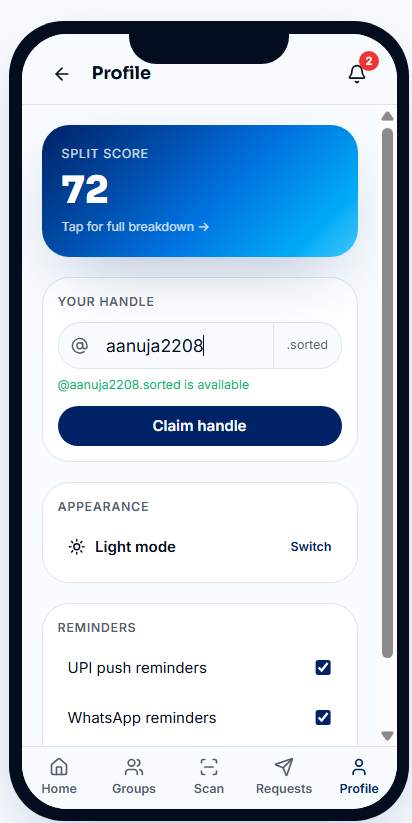

# Paytm Sorted: Gen Z UPI Social Splitting & Debt Recovery

A product teardown, strategy deck, and interactive prototype demonstrating how Paytm can capture the under-25 demographic through a native, social bill-splitting layer without compromising its core advertising and credit monetisation channels.

## 🔗 Project Links

*   **Lovable Live Prototype:** [https://sorted-paytm.lovable.app](https://sorted-paytm.lovable.app)
*   **Detailed Case Study:** [case_study.md](case_study.md)
*   **Local HTML Prototype:** [index.html](index.html)

---

## 🛠️ Tech Stack & Tools

*   **Frontend Framework:** React, TypeScript, Tailwind CSS (Lovable.dev)
*   **Database Design:** PostgreSQL (Relational schema modeling for transactions and splits)
*   **Protocols & APIs:** NPCI UPI Request Pay API specification, WebSockets for status synchronization

---

## 💡 Skills

*   **Root Cause Analysis (RCA):** Diagnosed Paytm's low Gen Z UPI volume share (7.9%) by identifying the conflict between rigid multi-product layouts and the student segment's need for simple social payments.
*   **Conversion Funnel Optimization:** Designed a workflow that cuts the steps required to split a bill from 7 manual interactions down to 2 taps.
*   **Behavioral Design & Gamification:** Conceived and implemented the "Split Score" system, utilizing social accountability and peer reputation to drive repayments.
*   **Technical System Design:** Modeled SQL database relations and mapped client-server communications with NPCI's API collect flow.
*   **Monetisation Alignment:** Balanced UX simplification with corporate unit economics by retaining ad slots and credit distribution channels, modifying only the targeting logic for the youth segment.

---

## 📋 Root Cause Analysis Summary

Paytm's decline in youth market share is not solved by simply cleaning up the user interface. Paytm relies on unsecured lending and ad revenue (generating ₹2,593 crore in financial services revenue in FY26). The root cause is a lack of dynamic personalization: the app serves the same home screen layout to a 19-year-old student as it does to a 45-year-old merchant. 

**Paytm Sorted** resolves this by acting as a contextual experience layer. It preserves ad banners and credit offers but dynamically filters them (e.g., student credit, concert deals) while making peer-to-peer social payments the primary interaction path.

---

## 🚀 Feature Walkthrough (Ordered by User Impact)

### Tier 1: Core Splitting Experience (Highest Impact)

#### 1. Itemized Bill Scanning & Grid Allocation
Address the friction of unequal dinner bills, cab rides, and groceries. 
*   **Scan & Auto-Itemize:** Users scan a receipt to pull items, quantities, and prices automatically.
*   **Checkbox Grid Allocation:** Who had what? Assign specific items to specific members.
*   **Proportional Tax Distribution:** Taxes and service fees are calculated and applied proportionally based on individual item consumption.

#### 2. Split Score (Reputation Meter)
Solve delayed repayments by introducing a visible accountability metric:
*   **State:** Users start with a score of 72 (reflecting "3 late repays this month") with a sparkline history graph.
*   **Rules:** On-time repayment adds 1 point. Group settlements add 1 point. Late payments subtract 2 points. Disputes past 7 days subtract 3 points.
*   **Utility:** Score above 95 unlocks brand discounts. Score below 70 highlights the user in red inside group split views, prompting peer-driven collections.

---

### Tier 2: Friction Reduction (Medium Impact)

#### 3. Automated Reminders Timeline
Take the awkwardness out of asking friends for money:
*   **T+0:** Request sent.
*   **T+2 days:** Gentle UPI push notification nudge.
*   **T+5 days:** WhatsApp reminder alert.
*   **T+7 days:** Final warning showing the impending drop in Split Score.

#### 4. Custom Handles
Prevent phone number leaks during casual group splits or outings:
*   **Format:** `@username.sorted` (e.g., `@karan.sorted`).
*   **Utility:** Acts as an alias linked to the user's primary UPI ID, allowing secure group participation.

---

### Tier 3: Engagement & Support (Low Impact)

#### 5. Smart Contact Memory
The app prioritizes and suggests the 5 to 10 friends paid most frequently, complete with past split context.

#### 6. Payment Comfort Mode
For anxious users, the app replaces technical error codes (e.g., U30) with clear explanations and a live refund tracker showing when their money will return to their account.

---

## 💻 Running the Local Prototype

To run the interactive prototype locally:
1. Open the [paytm_sorted](.) directory.
2. Double-click [index.html](index.html) to open it in any web browser.
3. Use the interface to create splits, adjust handle names, simulate payments, and watch the live database schema update dynamically.
